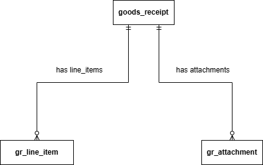

# GR POC Database Schema

## 1. Table Definitions

### 1.1 `goods_receipt`

The primary record for a single GR submission. Stores all fields extracted from the Delivery Order, submission metadata, and S3 references.

| Column | Type | Nullable | Default | Description |
| --- | --- | --- | --- | --- |
| `id` | `UUID` | NOT NULL | `gen_random_uuid()` | Primary key |
| `po_number` | `VARCHAR(100)` | NOT NULL | — | PO number extracted from Delivery Order |
| `vendor_name` | `VARCHAR(255)` | NOT NULL | — | Vendor name extracted from Delivery Order |
| `delivery_date` | `DATE` | NOT NULL | — | Delivery date extracted from Delivery Order |
| `status` | `VARCHAR(20)` | NOT NULL | `'DRAFT'` | GR lifecycle status: `DRAFT`, `SUBMITTED` |
| `origin` | `VARCHAR(20)` | NOT NULL | — | Teams delivery mode: `CHATBOT`, `LOWCODE`, `FULLCODE` |
| `submitted_by` | `VARCHAR(255)` | NOT NULL | — | Entra ID of the submitting user |
| `submitted_at` | `TIMESTAMPTZ` | NULL | — | Timestamp of final submission; NULL until submitted |
| `do_s3_key` | `VARCHAR(1024)` | NOT NULL | — | S3 object key for the uploaded Delivery Order |
| `created_at` | `TIMESTAMPTZ` | NOT NULL | `NOW()` | Record creation timestamp |
| `updated_at` | `TIMESTAMPTZ` | NOT NULL | `NOW()` | Last modification timestamp; auto-updated by trigger |

---

### 1.2 `gr_line_item`

One row per line item within a GR. Allows a GR to carry one or more extracted or user-edited item entries.

| Column | Type | Nullable | Default | Description |
| --- | --- | --- | --- | --- |
| `id` | `UUID` | NOT NULL | `gen_random_uuid()` | Primary key |
| `gr_id` | `UUID` | NOT NULL | — | Foreign key → `goods_receipt.id` |
| `sequence` | `SMALLINT` | NOT NULL | — | Display order of item within the GR (1-based) |
| `description` | `TEXT` | NOT NULL | — | Item description extracted or user-edited |
| `quantity` | `NUMERIC(12,4)` | NOT NULL | — | Item quantity; NUMERIC to support fractional units |
| `created_at` | `TIMESTAMPTZ` | NOT NULL | `NOW()` | Record creation timestamp |
| `updated_at` | `TIMESTAMPTZ` | NOT NULL | `NOW()` | Last modification timestamp; auto-updated by trigger |

---

### 1.3 `gr_attachment`

One row per supporting document uploaded alongside a GR submission (excluding the Delivery Order, which is tracked directly on `goods_receipt`).

| Column | Type | Nullable | Default | Description |
| --- | --- | --- | --- | --- |
| `id` | `UUID` | NOT NULL | `gen_random_uuid()` | Primary key |
| `gr_id` | `UUID` | NOT NULL | — | Foreign key → `goods_receipt.id` |
| `file_name` | `VARCHAR(512)` | NOT NULL | — | Original filename as uploaded by the user |
| `s3_key` | `VARCHAR(1024)` | NOT NULL | — | S3 object key for the stored file |
| `mime_type` | `VARCHAR(127)` | NOT NULL | — | MIME type of the file (e.g. `application/pdf`, `image/png`) |
| `file_size_bytes` | `BIGINT` | NOT NULL | — | File size in bytes; used for storage reporting and validation |
| `uploaded_at` | `TIMESTAMPTZ` | NOT NULL | `NOW()` | Timestamp of upload |

> `uploaded_at` only needs a created timestamp. No `updated_at` is required as attachments are write-once in this POC.
> 

---

## 2. Entity Relationship

All child records reference `goods_receipt.id` via a foreign key with `ON DELETE CASCADE`.

---

## 3. Constraints

| Table | Constraint | Type | Rule |
| --- | --- | --- | --- |
| `goods_receipt` | `chk_gr_status` | CHECK | `status` must be `DRAFT` or `SUBMITTED` |
| `goods_receipt` | `chk_gr_origin` | CHECK | `origin` must be `CHATBOT`, `LOWCODE`, or `FULLCODE` |
| `goods_receipt` | `chk_gr_submitted_at` | CHECK | `submitted_at` is NOT NULL when `SUBMITTED`; NULL when `DRAFT` |
| `gr_line_item` | `chk_line_item_quantity` | CHECK | `quantity` must be greater than zero |
| `gr_line_item` | `chk_line_item_sequence` | CHECK | `sequence` must be 1 or greater |
| `gr_line_item` | `uq_line_item_sequence` | UNIQUE | No duplicate sequence numbers within a GR |
| `gr_line_item` | `fk_line_item_gr` | FOREIGN KEY | Cascades on parent GR deletion |
| `gr_attachment` | `chk_attachment_mime_type` | CHECK | `mime_type` must be `image/png`, `image/jpeg`, or `application/pdf` |
| `gr_attachment` | `chk_attachment_file_size` | CHECK | `file_size_bytes` must be greater than zero |
| `gr_attachment` | `uq_attachment_s3_key` | UNIQUE | Each S3 key may only appear once |
| `gr_attachment` | `fk_attachment_gr` | FOREIGN KEY | Cascades on parent GR deletion |

---

## 4. Design Notes and Assumptions

| Item | Type | Detail |
| --- | --- | --- |
| `submitted_at` is nullable | Confirmed | A `DRAFT` GR has no submission timestamp. The CHECK constraint enforces consistency. |
| Attachment table does not track the Delivery Order | Confirmed | The DO S3 key is stored directly on `goods_receipt.do_s3_key`. Supporting documents only go into `gr_attachment`. |
| `NUMERIC(12,4)` for quantity | Assumption | Supports up to 4 decimal places and totals up to 99,999,999.9999. Adjust precision if fractional quantities are not required. |

---

## 5. Questions

1. Is `po_number` unique per submission?

No, not guaranteed. The `po_number` is extracted from the Delivery Order and originates from the vendor. Depending on the vendor, it may not be unique, so we shouldn't rely on it as a unique identifier or enforce a uniqueness constraint on it. The unique key per submission should be a system-generated submission ID rather than `po_number`.
